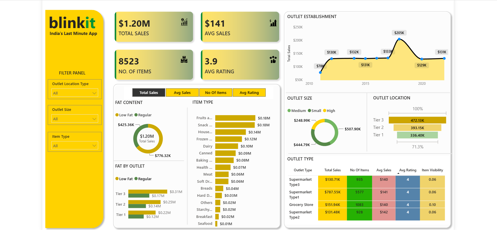

# 🛒 Blinkit Sales Analysis Dashboard | Power BI

> An interactive **Power BI business intelligence dashboard** that analyzes Blinkit's retail sales performance across outlets, products, customer ratings, and inventory categories to uncover actionable business insights and support data-driven decision making.

<p align="center">
  
</p>

<p align="center">


</p>

---

# 📌 Project Overview

Retail businesses generate massive amounts of transactional data every day. Without an analytical dashboard, identifying sales trends, outlet performance, customer preferences, and inventory opportunities becomes challenging.

This project presents an end-to-end **Power BI Sales Analytics Dashboard** built using Blinkit's grocery sales dataset. The dashboard converts raw retail data into meaningful KPIs, interactive visualizations, and business insights that help stakeholders monitor sales performance and make informed decisions.

---

# 🎯 Business Problem

Retail management teams need quick access to key performance indicators instead of manually reviewing spreadsheets.

The dashboard aims to answer critical business questions such as:

- Which outlet type generates the highest revenue?
- Which item categories contribute the most to sales?
- Which outlet locations perform best?
- How do outlet size and establishment year impact revenue?
- What is the average customer rating across different outlets?
- Which product categories require business attention?

---

# 📊 Dashboard Preview

<p align="center">

</p>

---

# 📈 Executive KPIs

| KPI | Value |
|------|-------|
| 💰 Total Sales | **$1.20M** |
| 🛒 Number of Items | **8,523** |
| 💵 Average Sales | **$141** |
| ⭐ Average Rating | **3.9 / 5** |

---

# 📊 Dashboard Features

## Executive KPI Cards

- Total Sales
- Average Sales
- Number of Items
- Average Customer Rating

---

## Interactive Filters

The dashboard includes dynamic slicers for:

- Outlet Location Type
- Outlet Size
- Item Type

Every visual updates automatically based on selected filters.

---

## Visualizations

### 📈 Outlet Establishment Trend

Analyzes sales performance based on outlet establishment year to identify long-term business growth.

---

### 🥗 Fat Content Analysis

Compares sales generated by:

- Low Fat Products
- Regular Products

Provides insights into customer purchasing preferences.

---

### 🛍 Item Type Performance

Ranks all product categories based on total sales.

Examples include:

- Fruits & Vegetables
- Snacks
- Household
- Dairy
- Frozen Foods
- Beverages
- Bakery
- Meat
- Seafood

---

### 🏪 Outlet Size Analysis

Compares sales generated by:

- Small Outlets
- Medium Outlets
- High Capacity Outlets

---

### 📍 Outlet Location Analysis

Evaluates performance across:

- Tier 1 Cities
- Tier 2 Cities
- Tier 3 Cities

---

### 📊 Outlet Type Comparison

Compares multiple business metrics across outlet types including:

- Total Sales
- Number of Items
- Average Sales
- Average Rating
- Item Visibility

---

# 🔍 Key Business Insights

### Sales Performance

- Overall business generated **$1.20M** in sales.
- Average sales per transaction stand at **$141**.

### Product Analysis

- Fruits & Vegetables and Snacks contribute the highest revenue.
- Seafood and Breakfast generate the lowest sales, indicating potential opportunities for product optimization.

### Outlet Analysis

- Medium-sized outlets contribute the largest share of revenue.
- Tier 3 locations outperform Tier 1 and Tier 2 in overall sales.

### Customer Experience

- The average customer rating remains **3.9**, indicating generally positive customer satisfaction.

### Business Growth

- Outlet establishments around **2018** recorded the highest sales performance, suggesting a peak expansion period.

---

# 🛠 Tech Stack

| Tool | Purpose |
|------|----------|
| Power BI | Dashboard Development |
| Power Query | Data Cleaning & Transformation |
| DAX | KPI & Measure Creation |
| Microsoft Excel | Data Source |
| Data Modeling | Relationship Management |

---

# ⚙ Data Preparation

The dataset was transformed before visualization using Power Query.

Data preparation included:

- Handling missing values
- Removing duplicate records
- Standardizing data types
- Data validation
- Creating calculated columns
- Building DAX measures
- Optimizing the data model for performance

---

# 📊 DAX Measures Used

Key measures created include:

- Total Sales
- Average Sales
- Average Rating
- Number of Items
- Sales by Outlet
- Sales by Item Category
- Dynamic KPI Measures

---

# 📂 Repository Structure

```
Blinkit-Sales-Analysis/
│
├── Blinkit_Dashboard.pbix
├── BlinkIT Grocery Data.xlsx
├── blinkit_dashboard.png
├── README.md
└── assets/
```

---

# 🚀 Skills Demonstrated

- Business Intelligence
- Retail Analytics
- Data Cleaning
- Power Query
- Data Modeling
- DAX
- KPI Development
- Dashboard Design
- Interactive Reporting
- Data Storytelling
- Data Visualization
- Business Insights Generation

---

# 📈 Business Value

This dashboard enables decision-makers to:

- Monitor overall business performance in real time.
- Identify top-performing product categories.
- Compare outlet performance across different city tiers.
- Optimize inventory based on product demand.
- Evaluate outlet expansion strategies.
- Improve strategic retail planning using data-driven insights.

---

# ⭐ Project Highlights

✔ Interactive Power BI Dashboard

✔ Professional Executive KPI Design

✔ Dynamic Filtering & Cross-Filtering

✔ Retail Sales Analytics

✔ Business-Oriented Visualizations

✔ Clean Dashboard Layout

✔ Decision-Support Reporting

✔ Recruiter-Friendly Portfolio Project

---

# 📚 Dataset Information

The dataset includes retail transaction data containing attributes such as:

- Item Type
- Fat Content
- Outlet Size
- Outlet Type
- Outlet Location
- Outlet Establishment Year
- Item Visibility
- Total Sales
- Customer Rating

---

# 💡 Future Enhancements

Future improvements planned for this project include:

- SQL integration for automated data refresh
- Profit and margin analysis
- Regional sales forecasting using Python
- Customer segmentation analysis
- Inventory optimization dashboard
- Time-series forecasting
- Drill-through reports for outlet-level insights

---

# 👨‍💻 Author

**Ashmit Srivastava**

Aspiring Data Analyst passionate about transforming raw data into actionable business insights through SQL, Excel, Power BI, Python, and data visualization.

### Connect with Me

- 💼 LinkedIn: *([ LinkedIn](https://www.linkedin.com/in/ashmit-srivastava0208/))*
- 💻 GitHub: *([GitHub](https://github.com/ashgithub0208))*

---

## ⭐ If you found this project helpful, consider giving it a Star!

If this dashboard helped you learn Power BI, retail analytics, or dashboard design, please consider starring the repository. Your support motivates me to build and share more data analytics projects.
